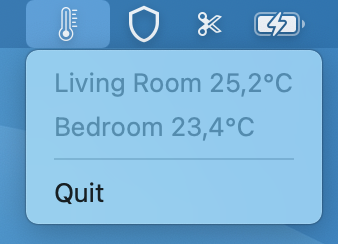

# Temperature Glance
Displays your HomeKit temperature sensors in your menu bar

# Screenshot

  

                                                 
# Note
This is a very simple app that I made for myself but decided to add here in case it's helpful to someone else 🙂. It wasn't extensively tested on different sensors or HomeKit accessories. If you find a bug feel free to add an issue. Although I'm not planning to spend too much time supporting this app, PRs are welcome :)
